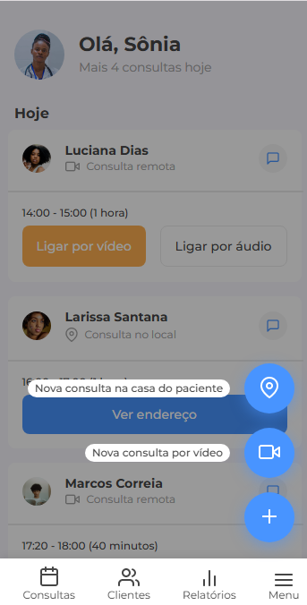
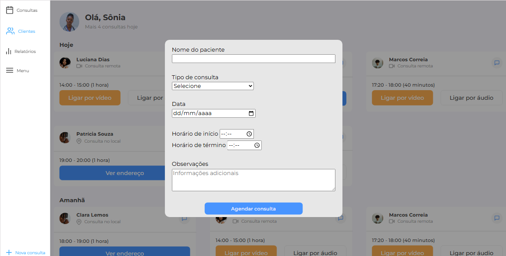

# Interface de Agendamento - Clínica Médica

> Projeto desenvolvido como parte do desafio **#7DaysOfCode** da Alura, focado na criação de uma interface responsiva para agendamento e visualização de consultas médicas.

A aplicação simula o painel de um profissional de saúde, onde é possível visualizar os agendamentos do dia e de datas futuras, com opções de interação para cada tipo de consulta (remota ou local).

### 🎨 Preview do Projeto
| Versão Mobile | Versão Tablet | Versão Desktop
| :---: | :---: | :---: |
|  |  |  |

## 🚀 Tecnologias Utilizadas

*   **HTML5:** Para a estrutura semântica do conteúdo.
*   **CSS3:** Para estilização, layouts com Flexbox e Grid, e responsividade com Media Queries.
*   **JavaScript:** Para a manipulação do DOM e criação de todas as interatividades da página.

## 💻 Funcionalidades
### 🎨 Design e Responsividade
O projeto foi desenvolvido com a abordagem **Mobile First**, garantindo uma experiência de qualidade em dispositivos móveis e depois adaptando o layout para telas maiores.
*   **360px (Base - Mobile):** A interface é vertical, com um menu de navegação fixo na parte inferior e um menu de ações flutuante para acesso rápido.
*   **768px (Tablet):** O layout começa a se adaptar, organizando os cards de consulta em um grid de duas colunas para melhor aproveitamento do espaço.
*   **1440px (Desktop):** O menu de navegação move-se para uma barra lateral fixa à esquerda, o conteúdo principal se expande para um grid de três colunas, e as opções de "Nova Consulta" são acessadas diretamente pelo menu lateral.

### ✨ Funcionalidades JavaScript
O JavaScript foi utilizado para dar vida à interface, focando em uma experiência de usuário fluida e intuitiva.
*  **Menu de Ações Flutuante (FAB - Floating Action Button):** No layout mobile, um botão principal com um ícone de "+" pode ser clicado para expandir e revelar outras duas opções. Ao expandir o menu, um *overlay* escurecido é aplicado ao fundo da página, focando a atenção do usuário nas ações disponíveis.
* **Modal para Agendamento de Novas Consultas:** Ao clicar no botão "Nova consulta" (disponível no menu lateral na versão desktop), um formulário modal é exibido no centro da tela.  
